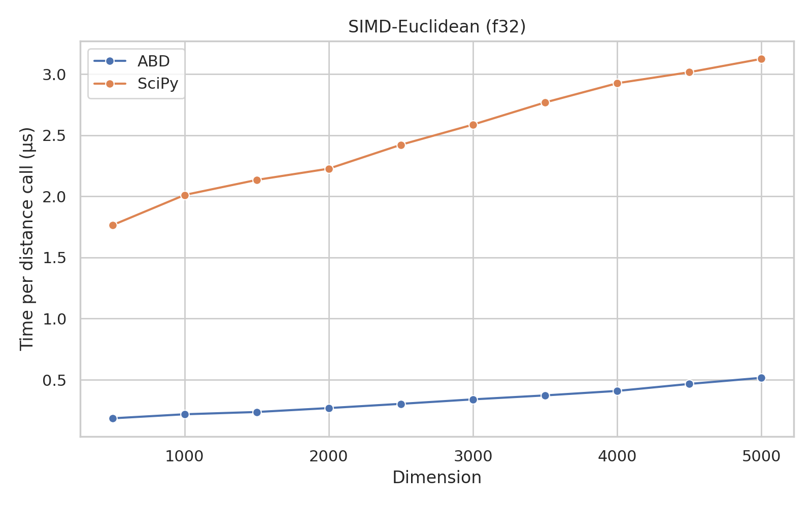
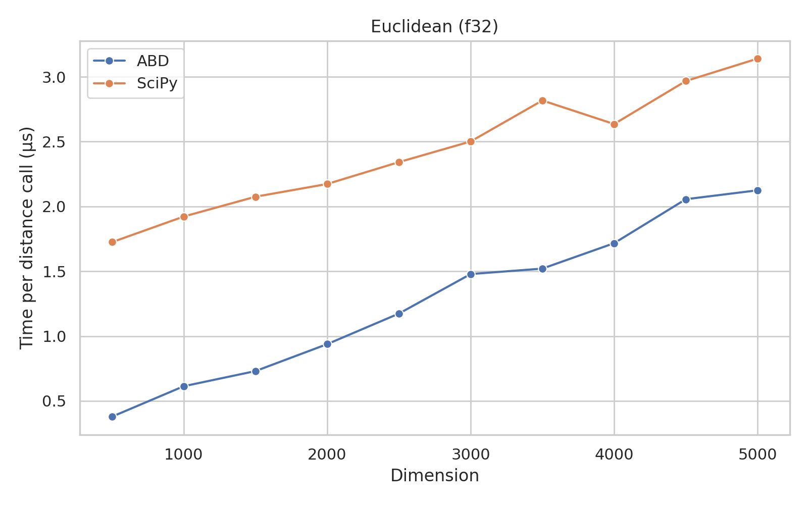
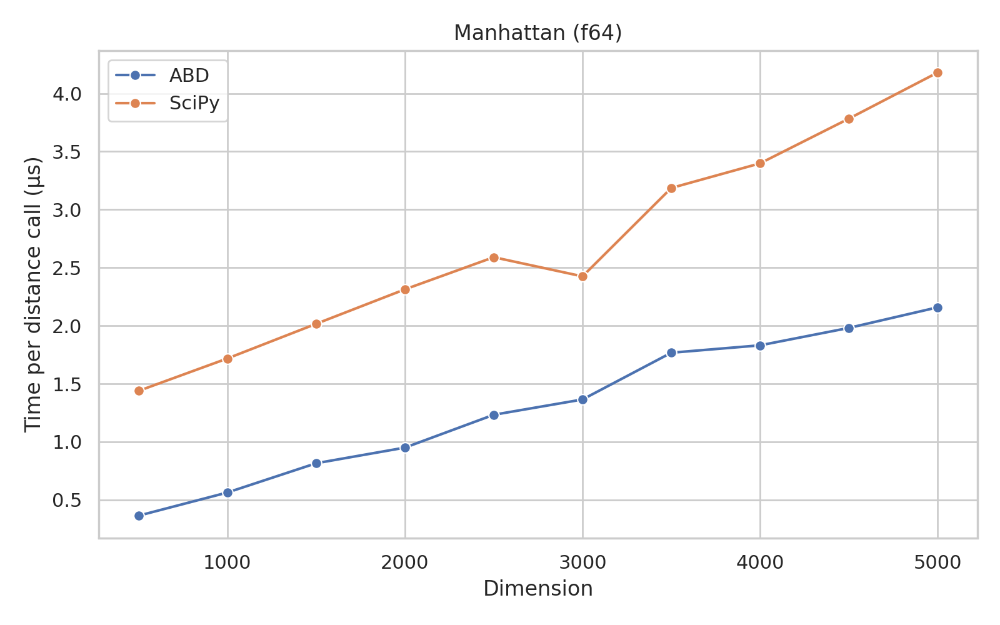
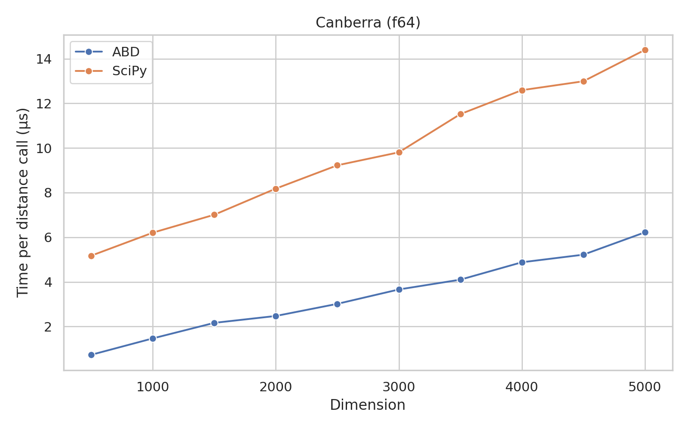
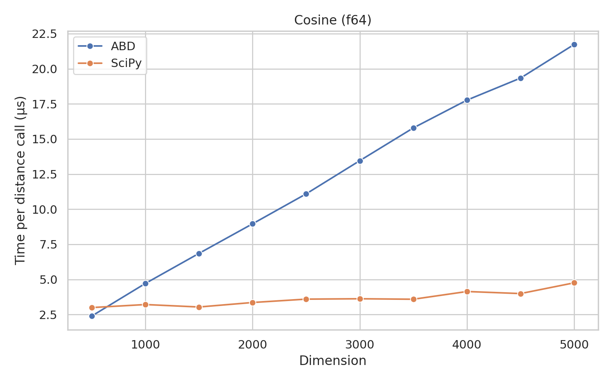

# Algorithms for Big Data: Distances (v1.0.2)

This package contains algorithms for computing distances between data points.
It is a thin Python wrapper around the `distances` crate, in Rust.
It provides drop-in replacements for the distance functions in `scipy.spatial.distance`.

## Supported Distance Functions

## Installation

```bash
pip install abd-distances
```

## Usage

```python
import math

import numpy
import abd_distances.simd as distance

a = numpy.array([i for i in range(10_000)], dtype=numpy.float32)
b = a + 1.0

dist = distance.euclidean(a, b)

assert math.fabs(dist - 100.0) < 1e-6

print(dist)
# 100.0
```

### Vector Distances

- [x] Bray-Curtis: `abd_distances.vector.braycurtis`
- [x] Canberra: `abd_distances.vector.canberra`
- [x] Chebyshev: `abd_distances.vector.chebyshev`
- [ ] Correlation
- [x] Cosine: `abd_distances.vector.cosine`
- [x] Euclidean: `abd_distances.vector.euclidean`
- [ ] Jensen-Shannon
- [ ] Mahalanobis
- [x] Manhattan: `abd_distances.vector.manhattan` and `abd_distances.vector.cityblock`
- [x] Minkowski: `abd_distances.vector.minkowski`
- [ ] Standardized Euclidean
- [x] Squared Euclidean: `abd_distances.vector.sqeuclidean`
- [x] Pairwise Distances: `abd_distances.vector.cdist` and `abd_distances.vector.pdist`
- [ ] ...

#### Boolean Distances

- [ ] Dice
- [ ] Hamming
- [ ] Jaccard
- [ ] Kulczynski 1D
- [ ] Rogers-Tanimoto
- [ ] Russell-Rao
- [ ] Sokal-Michener
- [ ] Sokal-Sneath
- [ ] Yule
- [ ] ...

### SIMD-Accelerated Vector Distances

- [x] Euclidean: `abd_distances.simd.euclidean`
- [x] Squared Euclidean: `abd_distances.simd.sqeuclidean`
- [x] Cosine: `abd_distances.simd.cosine`
- [x] Pairwise Distances: `abd_distances.simd.cdist` and `abd_distances.simd.pdist`
- [ ] ...

### String Distances

- [x] Hamming: `abd_distances.strings.hamming`
- [x] Levenshtein: `abd_distances.strings.levenshtein`
- [x] Needleman-Wunsch: `abd_distances.strings.needleman_wunsch`
- [ ] Smith-Waterman
- [ ] Pairwise Distances
- [ ] ...

## Benchmarks

### SIMD-Accelerated Vector Distance Benchmarks

These benchmarks were run on an Intel Core i7-11700KF CPU @ 4.900GHz, using **a single thread**.
The OS was Arch Linux, with kernel version 6.7.4-arch1-1.

The "Min", "Max", and "Mean" columns show the minimum, maximum, and mean times (in seconds), respectively, taken to compute the pairwise distances using the functions from `scipy.spatial.distance`.
The "Min (+)", "Max (+)", and "Mean (+)" columns show the speedup of the this package's functions over the `scipy` functions.
All pairwise distances (`cdist` and `pdist`) were computed for 200x200 vectors of 500 dimensions, and the average time was taken over 100 runs.
All individual distances were computed for 20x20 vectors of 500 dimensions, and the average time was taken over 100 runs.

|               Benchmark | Min     | Max     | Mean    | Min (+)         | Max (+)         | Mean (+)        |
|-------------------------|---------|---------|---------|-----------------|-----------------|-----------------|
|   cdist, euclidean, f32 | 2.560   | 2.576   | 2.566   | 0.185 (13.9x)   | 0.196 (13.2x)   | 0.188 (13.7x)   |
|   cdist, euclidean, f64 | 2.398   | 2.406   | 2.401   | 0.292 (8.2x)    | 0.307 (7.8x)    | 0.298 (8.0x)    |
| cdist, sqeuclidean, f32 | 2.519   | 2.527   | 2.523   | 0.182 (13.9x)   | 0.197 (12.8x)   | 0.187 (13.5x)   |
| cdist, sqeuclidean, f64 | 2.381   | 2.393   | 2.389   | 0.293 (8.1x)    | 0.318 (7.5x)    | 0.301 (7.9x)    |
|      cdist, cosine, f32 | 4.011   | 4.021   | 4.016   | 0.625 (6.4x)    | 0.637 (6.3x)    | 0.632 (6.4x)    |
|      cdist, cosine, f64 | 3.978   | 4.009   | 3.992   | 0.626 (6.4x)    | 0.666 (6.0x)    | 0.638 (6.3x)    |
|   pdist, euclidean, f32 | 1.235   | 1.249   | 1.241   | 0.252 (4.9x)    | 0.263 (4.7x)    | 0.257 (4.8x)    |
|   pdist, euclidean, f64 | 1.216   | 1.262   | 1.234   | 0.302 (4.0x)    | 0.312 (4.0x)    | 0.308 (4.0x)    |
| pdist, sqeuclidean, f32 | 1.229   | 1.250   | 1.237   | 0.251 (4.9x)    | 0.303 (4.1x)    | 0.265 (4.7x)    |
| pdist, sqeuclidean, f64 | 1.209   | 1.213   | 1.211   | 0.306 (3.9x)    | 0.313 (3.9x)    | 0.310 (3.9x)    |
|      pdist, cosine, f32 | 2.001   | 2.017   | 2.006   | 0.468 (4.3x)    | 0.484 (4.2x)    | 0.478 (4.2x)    |
|      pdist, cosine, f64 | 1.991   | 2.004   | 1.996   | 0.461 (4.3x)    | 0.476 (4.2x)    | 0.471 (4.2x)    |
|          euclidean, f32 | 0.644   | 0.670   | 0.654   | 0.076 (8.5x)    | 0.080 (8.4x)    | 0.078 (8.3x)    |
|          euclidean, f64 | 0.672   | 0.701   | 0.682   | 0.097 (6.9x)    | 0.102 (6.9x)    | 0.100 (6.8x)    |
|        sqeuclidean, f32 | 0.506   | 0.512   | 0.508   | 0.076 (6.6x)    | 0.079 (6.5x)    | 0.078 (6.5x)    |
|        sqeuclidean, f64 | 0.515   | 0.519   | 0.518   | 0.100 (5.1x)    | 0.104 (5.0x)    | 0.103 (5.0x)    |
|             cosine, f32 | 0.668   | 0.687   | 0.677   | 0.110 (6.1x)    | 0.113 (6.1x)    | 0.111 (6.1x)    |
|             cosine, f64 | 0.465   | 0.472   | 0.469   | 0.127 (3.7x)    | 0.130 (3.6x)    | 0.129 (3.6x)    |

<table>
<tr>
<th> f32 </th>
<th> f64 </th>
</tr>
<tr>
<td>




</td>
<td>


</td>
</tr>
</table>

### Vector Distance Benchmarks (No SIMD)

These benchmarks were run on an Intel Core i7-11700KF CPU @ 4.900GHz, using **a single thread**.
The OS was Arch Linux, with kernel version 6.7.4-arch1-1.

The "Min", "Max", and "Mean" columns show the minimum, maximum, and mean times (in seconds), respectively, taken to compute the pairwise distances using the functions from `scipy.spatial.distance`.
The "Min (+)", "Max (+)", and "Mean (+)" columns show the speedup of the this package's functions over the `scipy` functions.
All pairwise distances (`cdist` and `pdist`) were computed for 200x200 vectors of 500 dimensions, and the average time was taken over 100 runs.
All individual distances were computed for 20x20 vectors of 500 dimensions, and the average time was taken over 100 runs.

These benchmarks were run using the `richbench` package.

|               Benchmark | Min     | Max     | Mean    | Min (+)         | Max (+)         | Mean (+)        |
|-------------------------|---------|---------|---------|-----------------|-----------------|-----------------|
|         braycurtis, f32 | 1.103   | 1.134   | 1.114   | 0.323 (3.4x)    | 0.324 (3.5x)    | 0.323 (3.4x)    |
|         braycurtis, f64 | 0.834   | 0.843   | 0.838   | 0.170 (4.9x)    | 0.173 (4.9x)    | 0.171 (4.9x)    |
|           canberra, f32 | 2.524   | 2.529   | 2.526   | 0.153 (16.5x)   | 0.155 (16.3x)   | 0.154 (16.4x)   |
|           canberra, f64 | 2.216   | 2.260   | 2.235   | 0.168 (13.2x)   | 0.170 (13.3x)   | 0.169 (13.2x)   |
|          chebyshev, f32 | 2.738   | 2.774   | 2.753   | 0.149 (18.3x)   | 0.151 (18.4x)   | 0.150 (18.4x)   |
|          chebyshev, f64 | 2.777   | 2.784   | 2.781   | 0.165 (16.8x)   | 0.166 (16.8x)   | 0.165 (16.8x)   |
|          euclidean, f32 | 0.641   | 0.641   | 0.641   | 0.150 (4.3x)    | 0.150 (4.3x)    | 0.150 (4.3x)    |
|          euclidean, f64 | 0.657   | 0.662   | 0.660   | 0.167 (3.9x)    | 0.168 (3.9x)    | 0.168 (3.9x)    |
|        sqeuclidean, f32 | 0.506   | 0.509   | 0.507   | 0.149 (3.4x)    | 0.149 (3.4x)    | 0.149 (3.4x)    |
|        sqeuclidean, f64 | 0.514   | 0.518   | 0.516   | 0.165 (3.1x)    | 0.173 (3.0x)    | 0.170 (3.0x)    |
|          cityblock, f32 | 0.437   | 0.443   | 0.440   | 0.150 (2.9x)    | 0.150 (2.9x)    | 0.150 (2.9x)    |
|          cityblock, f64 | 0.444   | 0.451   | 0.447   | 0.167 (2.7x)    | 0.168 (2.7x)    | 0.168 (2.7x)    |
|             cosine, f32 | 0.659   | 0.668   | 0.664   | 0.314 (2.1x)    | 0.315 (2.1x)    | 0.314 (2.1x)    |
|             cosine, f64 | 0.459   | 0.471   | 0.465   | 0.321 (1.4x)    | 0.325 (1.4x)    | 0.324 (1.4x)    |
|  cdist, braycurtis, f32 | 4.902   | 4.906   | 4.904   | 1.802 (2.7x)    | 1.875 (2.6x)    | 1.833 (2.7x)    |
|  cdist, braycurtis, f64 | 4.765   | 4.775   | 4.768   | 0.710 (6.7x)    | 0.735 (6.5x)    | 0.725 (6.6x)    |
|    cdist, canberra, f32 | 6.914   | 6.943   | 6.930   | 1.356 (5.1x)    | 1.385 (5.0x)    | 1.367 (5.1x)    |
|    cdist, canberra, f64 | 6.782   | 6.813   | 6.797   | 0.684 (9.9x)    | 0.701 (9.7x)    | 0.692 (9.8x)    |
|   cdist, chebyshev, f32 | 2.763   | 2.768   | 2.765   | 0.640 (4.3x)    | 0.663 (4.2x)    | 0.649 (4.3x)    |
|   cdist, chebyshev, f64 | 2.659   | 2.677   | 2.664   | 0.647 (4.1x)    | 0.662 (4.0x)    | 0.655 (4.1x)    |
|   cdist, euclidean, f32 | 2.563   | 2.570   | 2.564   | 0.644 (4.0x)    | 0.658 (3.9x)    | 0.653 (3.9x)    |
|   cdist, euclidean, f64 | 2.378   | 2.400   | 2.388   | 0.630 (3.8x)    | 0.649 (3.7x)    | 0.640 (3.7x)    |
| cdist, sqeuclidean, f32 | 2.516   | 2.523   | 2.519   | 0.648 (3.9x)    | 0.660 (3.8x)    | 0.652 (3.9x)    |
| cdist, sqeuclidean, f64 | 2.412   | 2.423   | 2.417   | 0.631 (3.8x)    | 0.645 (3.8x)    | 0.638 (3.8x)    |
|   cdist, cityblock, f32 | 4.545   | 4.552   | 4.548   | 0.647 (7.0x)    | 0.671 (6.8x)    | 0.658 (6.9x)    |
|   cdist, cityblock, f64 | 4.406   | 4.407   | 4.407   | 0.633 (7.0x)    | 0.657 (6.7x)    | 0.647 (6.8x)    |
|      cdist, cosine, f32 | 4.010   | 4.020   | 4.013   | 2.254 (1.8x)    | 2.292 (1.8x)    | 2.270 (1.8x)    |
|      cdist, cosine, f64 | 3.987   | 3.992   | 3.990   | 2.241 (1.8x)    | 2.288 (1.7x)    | 2.258 (1.8x)    |
|  pdist, braycurtis, f32 | 2.382   | 2.387   | 2.385   | 1.062 (2.2x)    | 1.074 (2.2x)    | 1.069 (2.2x)    |
|  pdist, braycurtis, f64 | 2.368   | 2.378   | 2.371   | 0.510 (4.6x)    | 0.523 (4.5x)    | 0.516 (4.6x)    |
|    pdist, canberra, f32 | 3.374   | 3.411   | 3.389   | 0.831 (4.1x)    | 0.841 (4.1x)    | 0.835 (4.1x)    |
|    pdist, canberra, f64 | 3.369   | 3.411   | 3.396   | 0.504 (6.7x)    | 0.515 (6.6x)    | 0.509 (6.7x)    |
|   pdist, chebyshev, f32 | 1.362   | 1.364   | 1.363   | 0.478 (2.9x)    | 0.488 (2.8x)    | 0.484 (2.8x)    |
|   pdist, chebyshev, f64 | 1.338   | 1.343   | 1.341   | 0.476 (2.8x)    | 0.485 (2.8x)    | 0.481 (2.8x)    |
|   pdist, euclidean, f32 | 1.241   | 1.250   | 1.246   | 0.482 (2.6x)    | 0.487 (2.6x)    | 0.484 (2.6x)    |
|   pdist, euclidean, f64 | 1.222   | 1.228   | 1.225   | 0.474 (2.6x)    | 0.503 (2.4x)    | 0.482 (2.5x)    |
| pdist, sqeuclidean, f32 | 1.224   | 1.247   | 1.233   | 0.477 (2.6x)    | 0.490 (2.5x)    | 0.481 (2.6x)    |
| pdist, sqeuclidean, f64 | 1.211   | 1.214   | 1.213   | 0.470 (2.6x)    | 0.478 (2.5x)    | 0.475 (2.6x)    |
|   pdist, cityblock, f32 | 2.204   | 2.207   | 2.205   | 0.483 (4.6x)    | 0.491 (4.5x)    | 0.486 (4.5x)    |
|   pdist, cityblock, f64 | 2.189   | 2.198   | 2.192   | 0.476 (4.6x)    | 0.483 (4.5x)    | 0.481 (4.6x)    |
|      pdist, cosine, f32 | 2.000   | 2.004   | 2.002   | 1.292 (1.5x)    | 1.302 (1.5x)    | 1.296 (1.5x)    |
|      pdist, cosine, f64 | 1.988   | 1.992   | 1.990   | 1.288 (1.5x)    | 1.296 (1.5x)    | 1.292 (1.5x)    |


<table>
<tr>
<th> F32 </th>
<th> F64 </th>
</tr>
<tr>
<td>





</td>
<td>






</td>
</tr>
</table>

<table>
<tr>
<th> u32 </th>
<th> u64 </th>
</tr>
<tr>
<td>


</td>
<td>


</td>
</tr>
</table>
</table>

### String Distance Benchmarks

These benchmarks were run on an Intel Core i7-11700KF CPU @ 4.900GHz, using **a single thread**.
The OS was Arch Linux, with kernel version 6.7.4-arch1-1.

All string distances were computed 100 times each, among different pairs of strings, and the average time was taken.

<table>
<tr>
<td>


</td>
</tr>
</table>

## License

This package is licensed under the MIT license.
