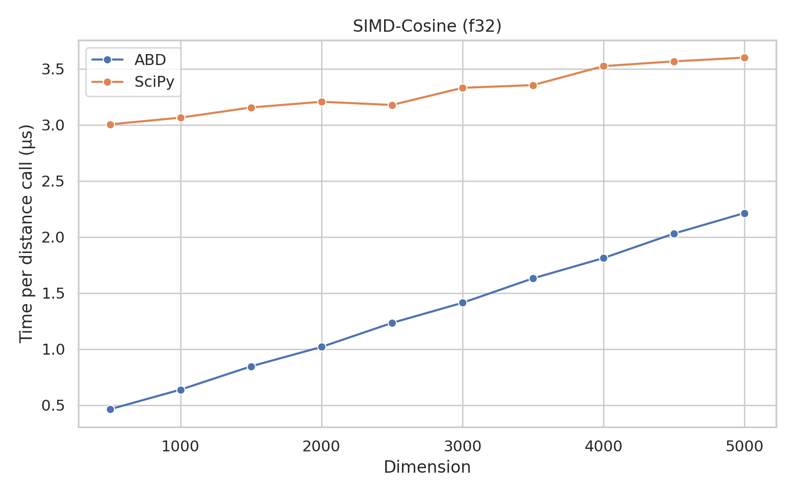
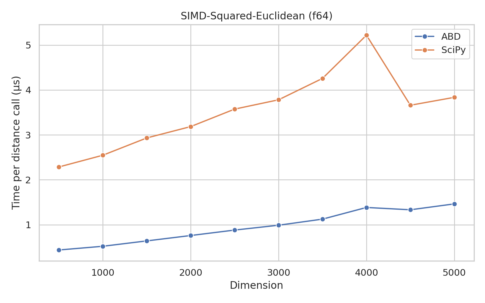
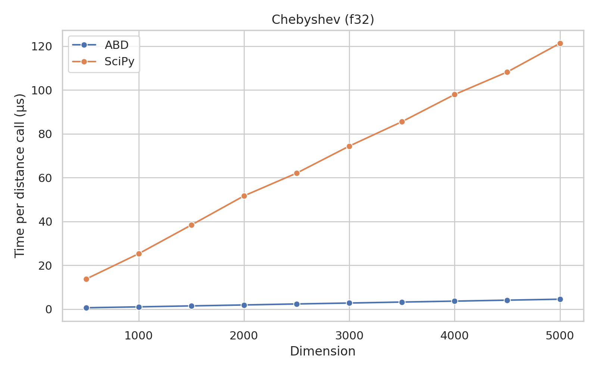
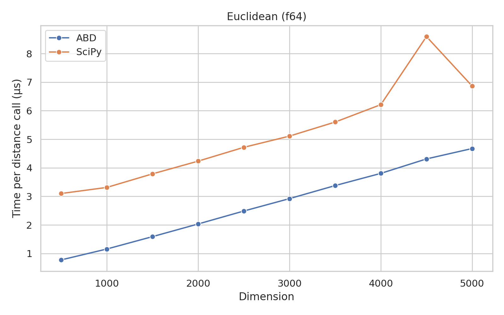
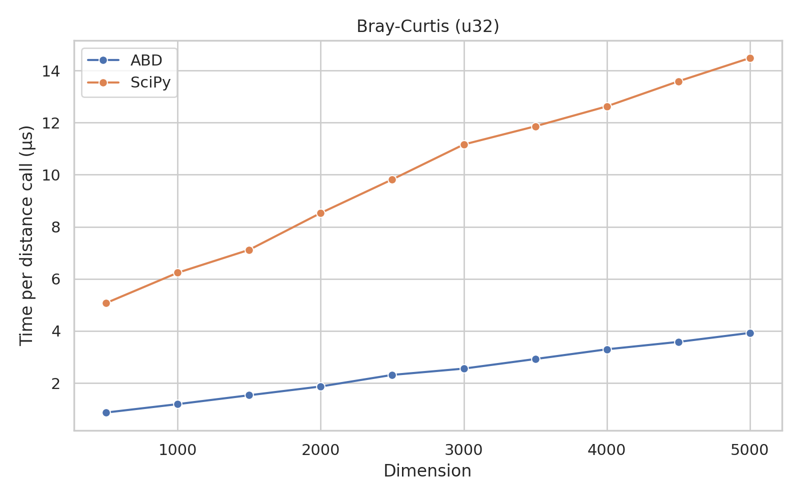

# Algorithms for Big Data: Distances (v1.0.0-dev0)

This package contains algorithms for computing distances between data points.
It is a thin Python wrapper around the `distances` crate, in Rust.

## Installation

```bash
pip install abd_distances@1.0.0-dev0
```

## Usage

```python
import numpy

from abd_distances.simd import euclidean_f32

a = numpy.array([1.0, 2.0, 3.0], dtype=numpy.float32)
b = a + 3.0

distance = euclidean_f32(a, b)

print(distance)
```

## Benchmarks

These benchmarks were run on an Intel Core i7-11700KF CPU @ 4.900GHz, using a single thread.
The OS was Arch Linux, with kernel version 6.7.4-arch1-1.

### Pairwise Distance Benchmarks

These benchmarks were run on an Intel Core i7-11700KF CPU @ 4.900GHz, using all 16 threads.
The OS was Arch Linux, with kernel version 6.7.4-arch1-1.

The "Min", "Max", and "Mean" columns show the minimum, maximum, and mean times (in seconds), respectively, taken to compute the pairwise distances using the functions from `scipy.spatial.distance`.
The "Min (+)", "Max (+)", and "Mean (+)" columns show the speedup of the this package's functions over the `scipy` functions.
All distances were computed for 100x100 vectors of 1000 dimensions, and the average time was taken over 100 runs.

These benchmarks were run using the `richbench` package.

|              Benchmark | Min     | Max     | Mean    | Min (+)         | Max (+)         | Mean (+)        |
|------------------------|---------|---------|---------|-----------------|-----------------|-----------------|
|   cdist Euclidean, f32 | 1.311   | 1.340   | 1.323   | 0.105 (12.5x)   | 0.119 (11.3x)   | 0.109 (12.1x)   |
|   cdist Euclidean, f64 | 1.169   | 1.181   | 1.174   | 0.164 (7.1x)    | 0.169 (7.0x)    | 0.167 (7.0x)    |
| cdist SqEuclidean, f32 | 1.190   | 1.216   | 1.199   | 0.103 (11.6x)   | 0.117 (10.4x)   | 0.108 (11.1x)   |
| cdist SqEuclidean, f64 | 1.164   | 1.175   | 1.167   | 0.165 (7.1x)    | 0.198 (5.9x)    | 0.180 (6.5x)    |
|      cdist Cosine, f32 | 2.153   | 2.163   | 2.156   | 0.310 (7.0x)    | 0.328 (6.6x)    | 0.317 (6.8x)    |
|      cdist Cosine, f64 | 2.130   | 2.140   | 2.135   | 0.343 (6.2x)    | 0.367 (5.8x)    | 0.353 (6.0x)    |
|   pdist Euclidean, f32 | 0.640   | 0.651   | 0.645   | 0.131 (4.9x)    | 0.199 (3.3x)    | 0.159 (4.1x)    |
|   pdist Euclidean, f64 | 0.624   | 0.638   | 0.630   | 0.167 (3.7x)    | 0.178 (3.6x)    | 0.172 (3.7x)    |
| pdist SqEuclidean, f32 | 0.635   | 0.650   | 0.643   | 0.139 (4.6x)    | 0.147 (4.4x)    | 0.142 (4.5x)    |
| pdist SqEuclidean, f64 | 0.620   | 0.626   | 0.622   | 0.167 (3.7x)    | 0.184 (3.4x)    | 0.172 (3.6x)    |
|      pdist Cosine, f32 | 1.064   | 1.072   | 1.067   | 0.238 (4.5x)    | 0.254 (4.2x)    | 0.244 (4.4x)    |
|      pdist Cosine, f64 | 1.057   | 1.066   | 1.060   | 0.247 (4.3x)    | 0.256 (4.2x)    | 0.250 (4.2x)    |

### SIMD-Accelerated Vector Distances

These benchmarks were run on an Intel Core i7-11700KF CPU @ 4.900GHz, using a single thread.
The OS was Arch Linux, with kernel version 6.7.4-arch1-1.

<table>
<tr>
<th> f32 </th>
<th> f64 </th>
</tr>
<tr>
<td>




</td>
<td>





</td>
</tr>
</table>

### Vector Distance Benchmarks (No SIMD)

These benchmarks were run on an Intel Core i7-11700KF CPU @ 4.900GHz, using a single thread.
The OS was Arch Linux, with kernel version 6.7.4-arch1-1.

<table>
<tr>
<th> F32 </th>
<th> F64 </th>
</tr>
<tr>
<td>




</td>
<td>





</td>
</tr>
</table>

<table>
<tr>
<th> u32 </th>
<th> u64 </th>
</tr>
<tr>
<td>



</td>
<td>


</td>
</tr>
</table>

<table>
<tr>
<th> i32 </th>
<th> i64 </th>
</tr>
<tr>
<td>


</td>
<td>


</td>
</tr>
</table>

### String Distance Benchmarks

These benchmarks were run on an Intel Core i7-11700KF CPU @ 4.900GHz, using a single thread.
The OS was Arch Linux, with kernel version 6.7.4-arch1-1.

All string distances were computed 100 times each, among different pairs of strings, and the average time was taken.

<table>
<tr>
<th> Hamming </th>
<th> Levenshtein </th>
<th> Needleman-Wunsch </th>
</tr>
<tr>
<td>


</td>
<td>


</td>
<td>


</td>
</tr>
</table>

## License

This package is licensed under the MIT license.
