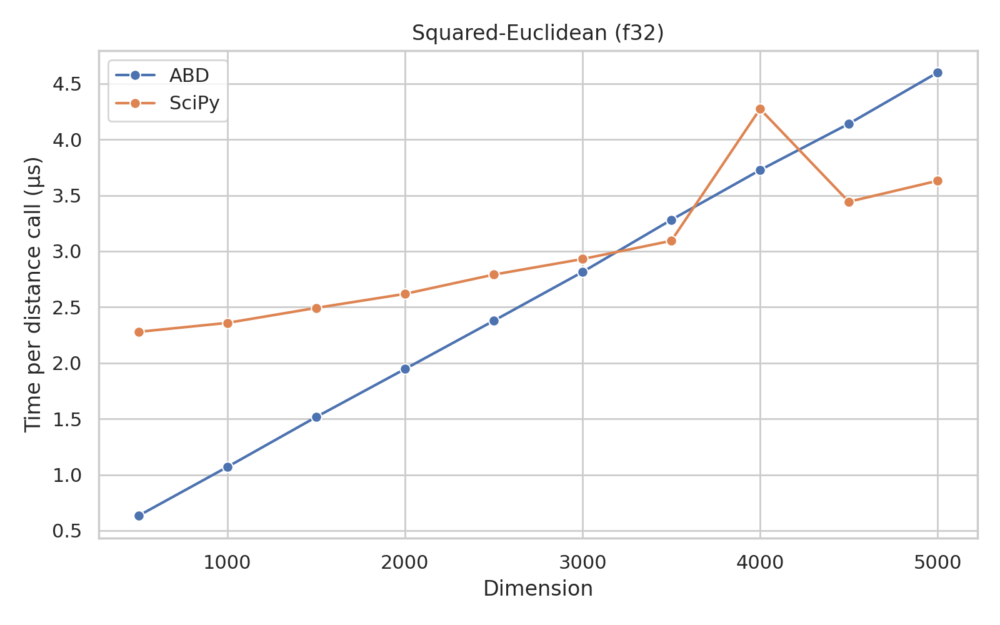
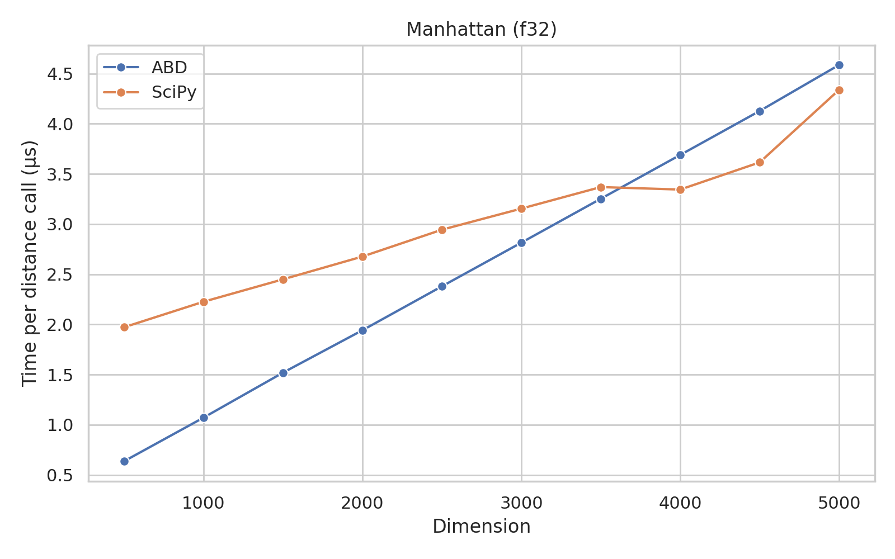

# Algorithms for Big Data: Distances (v1.0.0-dev0)

This package contains algorithms for computing distances between data points.
It is a thin Python wrapper around the `distances` crate, in Rust.

## Installation

### From PyPI

```bash
pip install abd-distances
```

### From Source

```bash
pip install --no-cache-dir git+https://github.com/nishaq503/clam.git@python/distances#python/distances
```

## Usage

```python
import numpy

import abd_distances.simd as distance

a = numpy.array([i for i in range(1_000)], dtype=numpy.float32)
b = a + 3.0

distance = distance.euclidean(a, b)

print(distance)

> 94.86833190917969
```

## Benchmarks

### SIMD-Accelerated Vector Distances

These benchmarks were run on an Intel Core i7-11700KF CPU @ 4.900GHz, using **a single thread**.
The OS was Arch Linux, with kernel version 6.7.4-arch1-1.

The "Min", "Max", and "Mean" columns show the minimum, maximum, and mean times (in seconds), respectively, taken to compute the pairwise distances using the functions from `scipy.spatial.distance`.
The "Min (+)", "Max (+)", and "Mean (+)" columns show the speedup of the this package's functions over the `scipy` functions.
All distances were computed for 100x100 vectors of 1000 dimensions, and the average time was taken over 100 runs.

|                     Benchmark | Min     | Max     | Mean    | Min (+)         | Max (+)         | Mean (+)        |
|-------------------------------|---------|---------|---------|-----------------|-----------------|-----------------|
|   SIMD, cdist, euclidean, f32 | 1.315   | 1.326   | 1.318   | 0.098 (13.4x)   | 0.126 (10.5x)   | 0.109 (12.1x)   |
|   SIMD, cdist, euclidean, f64 | 1.175   | 1.189   | 1.179   | 0.154 (7.6x)    | 0.173 (6.9x)    | 0.162 (7.3x)    |
| SIMD, cdist, sqeuclidean, f32 | 1.300   | 1.306   | 1.303   | 0.097 (13.4x)   | 0.100 (13.0x)   | 0.098 (13.2x)   |
| SIMD, cdist, sqeuclidean, f64 | 1.165   | 1.186   | 1.173   | 0.159 (7.3x)    | 0.177 (6.7x)    | 0.168 (7.0x)    |
|      SIMD, cdist, cosine, f32 | 2.146   | 2.154   | 2.149   | 0.301 (7.1x)    | 0.310 (7.0x)    | 0.305 (7.0x)    |
|      SIMD, cdist, cosine, f64 | 2.123   | 2.129   | 2.125   | 0.330 (6.4x)    | 0.335 (6.3x)    | 0.331 (6.4x)    |
|   SIMD, pdist, euclidean, f32 | 0.637   | 0.650   | 0.641   | 0.125 (5.1x)    | 0.137 (4.7x)    | 0.129 (5.0x)    |
|   SIMD, pdist, euclidean, f64 | 0.621   | 0.629   | 0.624   | 0.157 (3.9x)    | 0.164 (3.8x)    | 0.161 (3.9x)    |
| SIMD, pdist, sqeuclidean, f32 | 0.631   | 0.634   | 0.633   | 0.128 (4.9x)    | 0.144 (4.4x)    | 0.135 (4.7x)    |
| SIMD, pdist, sqeuclidean, f64 | 0.620   | 0.633   | 0.623   | 0.160 (3.9x)    | 0.197 (3.2x)    | 0.170 (3.7x)    |
|      SIMD, pdist, cosine, f32 | 1.063   | 1.066   | 1.064   | 0.228 (4.7x)    | 0.242 (4.4x)    | 0.232 (4.6x)    |
|      SIMD, pdist, cosine, f64 | 1.053   | 1.059   | 1.054   | 0.237 (4.4x)    | 0.248 (4.3x)    | 0.240 (4.4x)    |
|          SIMD, euclidean, f32 | 0.152   | 0.156   | 0.154   | 0.018 (8.3x)    | 0.018 (8.5x)    | 0.018 (8.4x)    |
|          SIMD, euclidean, f64 | 0.166   | 0.169   | 0.168   | 0.028 (6.0x)    | 0.028 (6.0x)    | 0.028 (6.0x)    |
|        SIMD, sqeuclidean, f32 | 0.121   | 0.124   | 0.122   | 0.018 (6.7x)    | 0.018 (6.8x)    | 0.018 (6.7x)    |
|        SIMD, sqeuclidean, f64 | 0.128   | 0.129   | 0.129   | 0.028 (4.6x)    | 0.028 (4.6x)    | 0.028 (4.6x)    |
|             SIMD, cosine, f32 | 0.143   | 0.144   | 0.144   | 0.033 (4.4x)    | 0.034 (4.3x)    | 0.033 (4.3x)    |
|             SIMD, cosine, f64 | 0.111   | 0.115   | 0.113   | 0.039 (2.9x)    | 0.062 (1.9x)    | 0.043 (2.6x)    |

<table>
<tr>
<th> f32 </th>
<th> f64 </th>
</tr>
<tr>
<td>


</td>
<td>


</td>
</tr>
</table>

### Vector Distance Benchmarks (No SIMD)

These benchmarks were run on an Intel Core i7-11700KF CPU @ 4.900GHz, using **a single thread**.
The OS was Arch Linux, with kernel version 6.7.4-arch1-1.

The "Min", "Max", and "Mean" columns show the minimum, maximum, and mean times (in seconds), respectively, taken to compute the pairwise distances using the functions from `scipy.spatial.distance`.
The "Min (+)", "Max (+)", and "Mean (+)" columns show the speedup of the this package's functions over the `scipy` functions.
All distances were computed for 100x100 vectors of 1000 dimensions, and the average time was taken over 100 runs.

These benchmarks were run using the `richbench` package.

|               Benchmark | Min     | Max     | Mean    | Min (+)         | Max (+)         | Mean (+)        |
|-------------------------|---------|---------|---------|-----------------|-----------------|-----------------|
|         braycurtis, f32 | 0.308   | 0.312   | 0.310   | 0.056 (5.5x)    | 0.057 (5.5x)    | 0.056 (5.5x)    |
|         braycurtis, f64 | 0.236   | 0.238   | 0.237   | 0.060 (3.9x)    | 0.061 (3.9x)    | 0.060 (3.9x)    |
|           canberra, f32 | 0.617   | 0.625   | 0.620   | 0.057 (10.9x)   | 0.057 (11.0x)   | 0.057 (10.9x)   |
|           canberra, f64 | 0.555   | 0.559   | 0.557   | 0.060 (9.2x)    | 0.060 (9.2x)    | 0.060 (9.2x)    |
|          chebyshev, f32 | 1.252   | 1.269   | 1.258   | 0.056 (22.6x)   | 0.056 (22.8x)   | 0.056 (22.6x)   |
|          chebyshev, f64 | 1.287   | 1.293   | 1.289   | 0.060 (21.6x)   | 0.060 (21.5x)   | 0.060 (21.6x)   |
|          euclidean, f32 | 0.153   | 0.155   | 0.154   | 0.055 (2.8x)    | 0.056 (2.8x)    | 0.056 (2.8x)    |
|          euclidean, f64 | 0.165   | 0.168   | 0.167   | 0.060 (2.8x)    | 0.060 (2.8x)    | 0.060 (2.8x)    |
|        sqeuclidean, f32 | 0.122   | 0.124   | 0.123   | 0.055 (2.2x)    | 0.056 (2.2x)    | 0.056 (2.2x)    |
|        sqeuclidean, f64 | 0.132   | 0.133   | 0.132   | 0.060 (2.2x)    | 0.060 (2.2x)    | 0.060 (2.2x)    |
|          cityblock, f32 | 0.115   | 0.117   | 0.116   | 0.055 (2.1x)    | 0.056 (2.1x)    | 0.055 (2.1x)    |
|          cityblock, f64 | 0.128   | 0.128   | 0.128   | 0.059 (2.1x)    | 0.060 (2.2x)    | 0.060 (2.1x)    |
|             cosine, f32 | 0.143   | 0.145   | 0.144   | 0.136 (1.1x)    | 0.137 (1.1x)    | 0.136 (1.1x)    |
|             cosine, f64 | 0.107   | 0.126   | 0.112   | 0.143 (-1.3x)   | 0.145 (-1.1x)   | 0.144 (-1.3x)   |
|  cdist, braycurtis, f32 | 2.504   | 2.530   | 2.511   | 0.333 (7.5x)    | 0.347 (7.3x)    | 0.341 (7.4x)    |
|    cdist, canberra, f32 | 3.526   | 3.557   | 3.540   | 0.697 (5.1x)    | 0.706 (5.0x)    | 0.702 (5.0x)    |
|   cdist, chebyshev, f32 | 1.432   | 1.472   | 1.445   | 0.337 (4.3x)    | 0.358 (4.1x)    | 0.344 (4.2x)    |
|   cdist, euclidean, f32 | 1.308   | 1.317   | 1.312   | 0.337 (3.9x)    | 0.349 (3.8x)    | 0.341 (3.8x)    |
| cdist, sqeuclidean, f32 | 1.301   | 1.327   | 1.308   | 0.337 (3.9x)    | 0.343 (3.9x)    | 0.340 (3.8x)    |
|   cdist, cityblock, f32 | 2.338   | 2.344   | 2.342   | 0.334 (7.0x)    | 0.354 (6.6x)    | 0.342 (6.9x)    |
|      cdist, cosine, f32 | 2.145   | 2.154   | 2.149   | 1.172 (1.8x)    | 1.217 (1.8x)    | 1.192 (1.8x)    |
|  cdist, braycurtis, f64 | 2.364   | 2.373   | 2.369   | 0.332 (7.1x)    | 0.348 (6.8x)    | 0.342 (6.9x)    |
|    cdist, canberra, f64 | 3.370   | 3.389   | 3.380   | 0.356 (9.5x)    | 0.418 (8.1x)    | 0.373 (9.1x)    |
|   cdist, chebyshev, f64 | 1.288   | 1.290   | 1.289   | 0.336 (3.8x)    | 0.352 (3.7x)    | 0.344 (3.7x)    |
|   cdist, euclidean, f64 | 1.167   | 1.193   | 1.176   | 0.333 (3.5x)    | 0.350 (3.4x)    | 0.339 (3.5x)    |
| cdist, sqeuclidean, f64 | 1.167   | 1.178   | 1.173   | 0.337 (3.5x)    | 0.351 (3.4x)    | 0.340 (3.4x)    |
|   cdist, cityblock, f64 | 2.200   | 2.210   | 2.205   | 0.338 (6.5x)    | 0.355 (6.2x)    | 0.344 (6.4x)    |
|      cdist, cosine, f64 | 2.122   | 2.126   | 2.124   | 1.157 (1.8x)    | 1.183 (1.8x)    | 1.167 (1.8x)    |
|  pdist, braycurtis, f32 | 1.189   | 1.191   | 1.190   | 0.244 (4.9x)    | 0.259 (4.6x)    | 0.252 (4.7x)    |
|    pdist, canberra, f32 | 1.679   | 1.698   | 1.687   | 0.420 (4.0x)    | 0.434 (3.9x)    | 0.427 (3.9x)    |
|   pdist, chebyshev, f32 | 0.694   | 0.703   | 0.697   | 0.247 (2.8x)    | 0.263 (2.7x)    | 0.252 (2.8x)    |
|   pdist, euclidean, f32 | 0.632   | 0.638   | 0.635   | 0.247 (2.6x)    | 0.260 (2.5x)    | 0.251 (2.5x)    |
| pdist, sqeuclidean, f32 | 0.630   | 0.631   | 0.631   | 0.246 (2.6x)    | 0.282 (2.2x)    | 0.257 (2.5x)    |
|   pdist, cityblock, f32 | 1.109   | 1.114   | 1.112   | 0.247 (4.5x)    | 0.255 (4.4x)    | 0.251 (4.4x)    |
|      pdist, cosine, f32 | 1.064   | 1.067   | 1.065   | 0.662 (1.6x)    | 0.694 (1.5x)    | 0.672 (1.6x)    |
|  pdist, braycurtis, f64 | 1.176   | 1.185   | 1.180   | 0.247 (4.8x)    | 0.256 (4.6x)    | 0.251 (4.7x)    |
|    pdist, canberra, f64 | 1.675   | 1.684   | 1.678   | 0.256 (6.5x)    | 0.268 (6.3x)    | 0.260 (6.4x)    |
|   pdist, chebyshev, f64 | 0.683   | 0.705   | 0.690   | 0.247 (2.8x)    | 0.257 (2.7x)    | 0.252 (2.7x)    |
|   pdist, euclidean, f64 | 0.623   | 0.624   | 0.623   | 0.244 (2.6x)    | 0.276 (2.3x)    | 0.255 (2.4x)    |
| pdist, sqeuclidean, f64 | 0.619   | 0.645   | 0.625   | 0.244 (2.5x)    | 0.253 (2.5x)    | 0.247 (2.5x)    |
|   pdist, cityblock, f64 | 1.095   | 1.100   | 1.097   | 0.245 (4.5x)    | 0.256 (4.3x)    | 0.250 (4.4x)    |
|      pdist, cosine, f64 | 1.053   | 1.056   | 1.055   | 0.658 (1.6x)    | 0.686 (1.5x)    | 0.669 (1.6x)    |


<table>
<tr>
<th> F32 </th>
<th> F64 </th>
</tr>
<tr>
<td>








</td>
<td>


</td>
</tr>
</table>

<table>
<tr>
<th> u32 </th>
<th> u64 </th>
</tr>
<tr>
<td>


</td>
<td>


</td>
</tr>
</table>

<table>
<tr>
<th> i32 </th>
<th> i64 </th>
</tr>
<tr>
<td>


</td>
<td>


</td>
</tr>
</table>

### String Distance Benchmarks

These benchmarks were run on an Intel Core i7-11700KF CPU @ 4.900GHz, using **a single thread**.
The OS was Arch Linux, with kernel version 6.7.4-arch1-1.

All string distances were computed 100 times each, among different pairs of strings, and the average time was taken.

<table>
<tr>
<th> Hamming </th>
<th> Levenshtein </th>
<th> Needleman-Wunsch </th>
</tr>
<tr>
<td>


</td>
<td>


</td>
<td>


</td>
</tr>
</table>

## License

This package is licensed under the MIT license.
