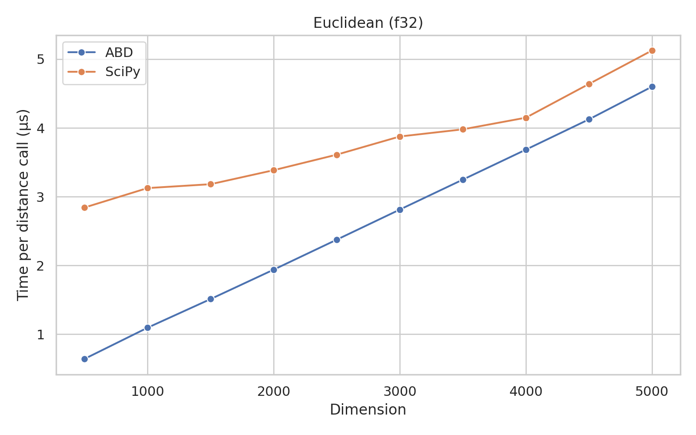
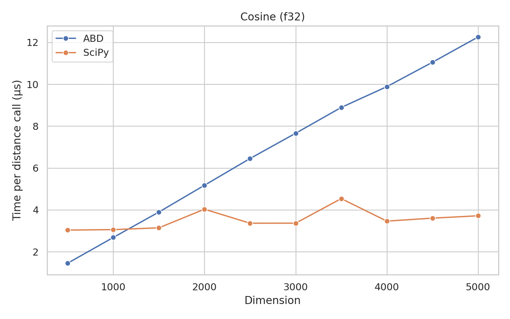
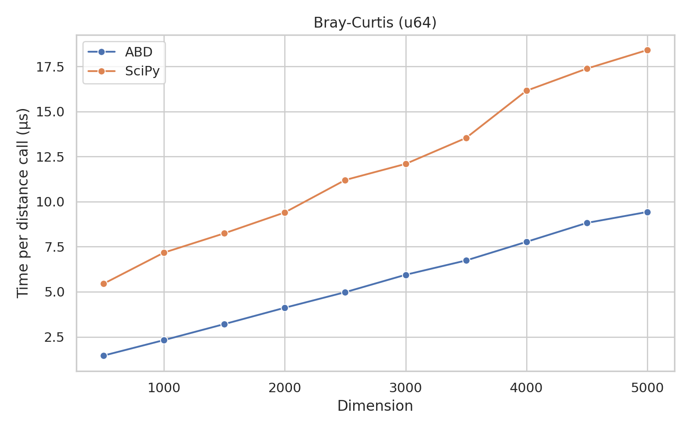

# Algorithms for Big Data: Distances (v1.0.0-dev0)

This package contains algorithms for computing distances between data points.
It is a thin Python wrapper around the `distances` crate, in Rust.

## Installation

### From PyPI

```bash
pip install abd-distances
```

### From Source

```bash
pip install --no-cache-dir git+https://github.com/nishaq503/clam.git@python/distances#python/distances
```

## Usage

```python
import numpy

from abd_distances.simd import euclidean_f32

a = numpy.array([1.0, 2.0, 3.0], dtype=numpy.float32)
b = a + 3.0

distance = euclidean_f32(a, b)

print(distance)
```

## Benchmarks

### Pairwise Distance Benchmarks

These benchmarks were run on an Intel Core i7-11700KF CPU @ 4.900GHz, using **all 16 threads**.
The OS was Arch Linux, with kernel version 6.7.4-arch1-1.

The "Min", "Max", and "Mean" columns show the minimum, maximum, and mean times (in seconds), respectively, taken to compute the pairwise distances using the functions from `scipy.spatial.distance`.
The "Min (+)", "Max (+)", and "Mean (+)" columns show the speedup of the this package's functions over the `scipy` functions.
All distances were computed for 100x100 vectors of 1000 dimensions, and the average time was taken over 100 runs.

These benchmarks were run using the `richbench` package.

|              Benchmark | Min     | Max     | Mean    | Min (+)         | Max (+)         | Mean (+)        |
|------------------------|---------|---------|---------|-----------------|-----------------|-----------------|
|         chebyshev, f32 | 1.310   | 1.338   | 1.323   | 0.076 (17.3x)   | 0.076 (17.5x)   | 0.076 (17.4x)   |
|         chebyshev, f64 | 1.280   | 1.323   | 1.294   | 0.081 (15.8x)   | 0.084 (15.7x)   | 0.082 (15.8x)   |
|         euclidean, f32 | 0.164   | 0.166   | 0.165   | 0.020 (8.1x)    | 0.021 (8.0x)    | 0.020 (8.1x)    |
|         euclidean, f64 | 0.174   | 0.182   | 0.177   | 0.032 (5.5x)    | 0.033 (5.5x)    | 0.032 (5.5x)    |
|       sqeuclidean, f32 | 0.086   | 0.087   | 0.087   | 0.020 (4.2x)    | 0.021 (4.2x)    | 0.020 (4.2x)    |
|       sqeuclidean, f64 | 0.109   | 0.109   | 0.109   | 0.031 (3.5x)    | 0.032 (3.5x)    | 0.031 (3.5x)    |
|         cityblock, f32 | 0.088   | 0.090   | 0.089   | 0.061 (1.4x)    | 0.064 (1.4x)    | 0.062 (1.4x)    |
|         cityblock, f64 | 0.094   | 0.095   | 0.095   | 0.066 (1.4x)    | 0.068 (1.4x)    | 0.067 (1.4x)    |
|       minkowski-3, f32 | 0.491   | 0.498   | 0.494   | 0.073 (6.7x)    | 0.073 (6.8x)    | 0.073 (6.7x)    |
|       minkowski-3, f64 | 0.645   | 0.675   | 0.662   | 0.080 (8.1x)    | 0.084 (8.0x)    | 0.081 (8.1x)    |
|       minkowski-4, f32 | 0.493   | 0.512   | 0.501   | 0.088 (5.6x)    | 0.091 (5.6x)    | 0.089 (5.6x)    |
|       minkowski-4, f64 | 0.646   | 0.666   | 0.656   | 0.095 (6.8x)    | 0.096 (7.0x)    | 0.095 (6.9x)    |
|            cosine, f32 | 0.118   | 0.120   | 0.118   | 0.028 (4.2x)    | 0.028 (4.3x)    | 0.028 (4.2x)    |
|            cosine, f64 | 0.142   | 0.146   | 0.143   | 0.038 (3.8x)    | 0.040 (3.7x)    | 0.039 (3.7x)    |
|   cdist-chebyshev, f32 | 1.641   | 1.656   | 1.646   | 0.775 (2.1x)    | 0.798 (2.1x)    | 0.786 (2.1x)    |
|   cdist-euclidean, f32 | 1.221   | 1.267   | 1.239   | 0.569 (2.1x)    | 0.587 (2.2x)    | 0.576 (2.2x)    |
| cdist-sqeuclidean, f32 | 1.225   | 1.234   | 1.230   | 0.564 (2.2x)    | 0.585 (2.1x)    | 0.575 (2.1x)    |
|   cdist-cityblock, f32 | 2.262   | 2.282   | 2.274   | 0.547 (4.1x)    | 0.575 (4.0x)    | 0.561 (4.1x)    |
|      cdist-cosine, f32 | 4.271   | 4.286   | 4.277   | 0.765 (5.6x)    | 0.793 (5.4x)    | 0.777 (5.5x)    |
|   cdist-chebyshev, f64 | 1.610   | 1.629   | 1.619   | 0.780 (2.1x)    | 0.816 (2.0x)    | 0.795 (2.0x)    |
|   cdist-euclidean, f64 | 1.210   | 1.219   | 1.212   | 0.574 (2.1x)    | 0.599 (2.0x)    | 0.584 (2.1x)    |
| cdist-sqeuclidean, f64 | 1.209   | 1.213   | 1.211   | 0.573 (2.1x)    | 0.704 (1.7x)    | 0.604 (2.0x)    |
|   cdist-cityblock, f64 | 2.232   | 2.242   | 2.237   | 0.569 (3.9x)    | 0.597 (3.8x)    | 0.581 (3.8x)    |
|      cdist-cosine, f64 | 4.240   | 4.267   | 4.248   | 0.775 (5.5x)    | 0.808 (5.3x)    | 0.787 (5.4x)    |
|   pdist-chebyshev, f32 | 0.871   | 0.883   | 0.878   | 0.484 (1.8x)    | 0.497 (1.8x)    | 0.492 (1.8x)    |
|   pdist-euclidean, f32 | 0.648   | 0.667   | 0.656   | 0.390 (1.7x)    | 0.405 (1.6x)    | 0.395 (1.7x)    |
| pdist-sqeuclidean, f32 | 0.644   | 0.659   | 0.653   | 0.391 (1.6x)    | 0.409 (1.6x)    | 0.397 (1.6x)    |
|   pdist-cityblock, f32 | 1.126   | 1.137   | 1.130   | 0.383 (2.9x)    | 0.389 (2.9x)    | 0.386 (2.9x)    |
|      pdist-cosine, f32 | 2.108   | 2.116   | 2.112   | 0.486 (4.3x)    | 0.497 (4.3x)    | 0.490 (4.3x)    |
|   pdist-chebyshev, f64 | 0.863   | 0.871   | 0.868   | 0.490 (1.8x)    | 0.523 (1.7x)    | 0.501 (1.7x)    |
|   pdist-euclidean, f64 | 0.647   | 0.649   | 0.648   | 0.392 (1.7x)    | 0.410 (1.6x)    | 0.397 (1.6x)    |
| pdist-sqeuclidean, f64 | 0.647   | 0.650   | 0.649   | 0.390 (1.7x)    | 0.409 (1.6x)    | 0.397 (1.6x)    |
|   pdist-cityblock, f64 | 1.115   | 1.147   | 1.124   | 0.388 (2.9x)    | 0.418 (2.7x)    | 0.403 (2.8x)    |
|      pdist-cosine, f64 | 2.101   | 2.108   | 2.104   | 0.484 (4.3x)    | 0.506 (4.2x)    | 0.494 (4.3x)    |

### SIMD-Accelerated Vector Distances

These benchmarks were run on an Intel Core i7-11700KF CPU @ 4.900GHz, using **a single thread**.
The OS was Arch Linux, with kernel version 6.7.4-arch1-1.

<table>
<tr>
<th> f32 </th>
<th> f64 </th>
</tr>
<tr>
<td>


</td>
<td>


</td>
</tr>
</table>

### Vector Distance Benchmarks (No SIMD)

These benchmarks were run on an Intel Core i7-11700KF CPU @ 4.900GHz, using **a single thread**.
The OS was Arch Linux, with kernel version 6.7.4-arch1-1.

<table>
<tr>
<th> F32 </th>
<th> F64 </th>
</tr>
<tr>
<td>







</td>
<td>


</td>
</tr>
</table>

<table>
<tr>
<th> u32 </th>
<th> u64 </th>
</tr>
<tr>
<td>


</td>
<td>



</td>
</tr>
</table>

<table>
<tr>
<th> i32 </th>
<th> i64 </th>
</tr>
<tr>
<td>


</td>
<td>


</td>
</tr>
</table>

### String Distance Benchmarks

These benchmarks were run on an Intel Core i7-11700KF CPU @ 4.900GHz, using **a single thread**.
The OS was Arch Linux, with kernel version 6.7.4-arch1-1.

All string distances were computed 100 times each, among different pairs of strings, and the average time was taken.

<table>
<tr>
<th> Hamming </th>
<th> Levenshtein </th>
<th> Needleman-Wunsch </th>
</tr>
<tr>
<td>


</td>
<td>


</td>
<td>


</td>
</tr>
</table>

## License

This package is licensed under the MIT license.
