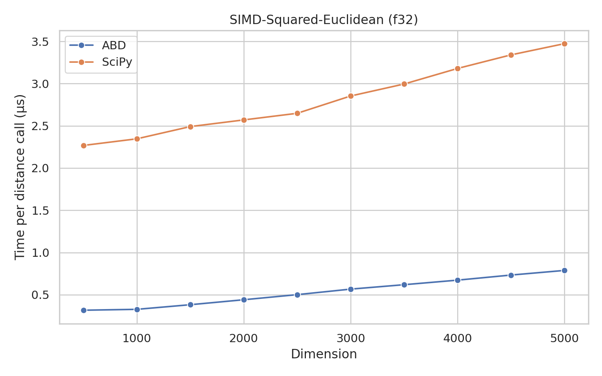
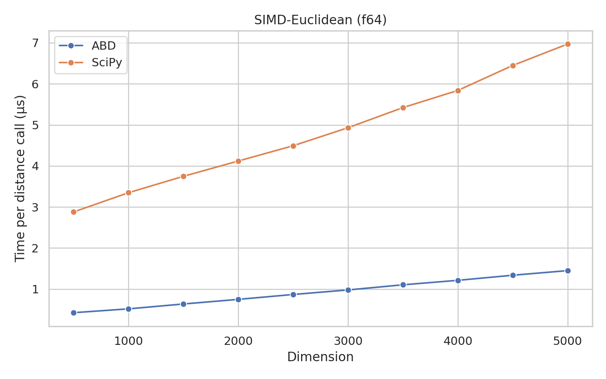
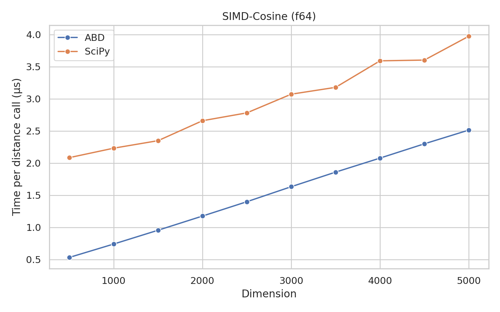
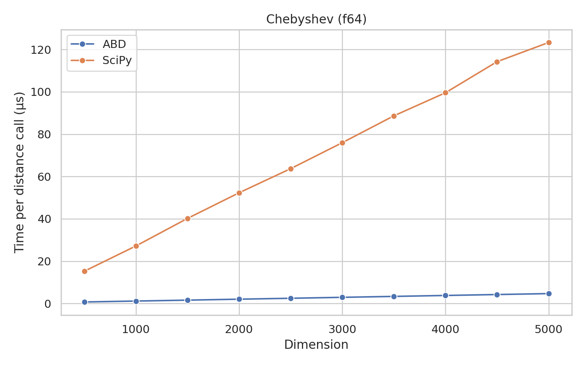
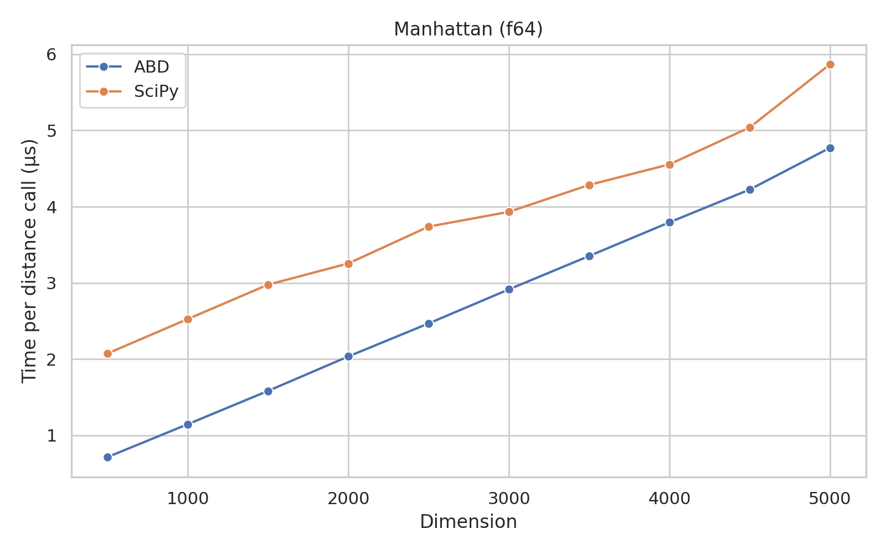
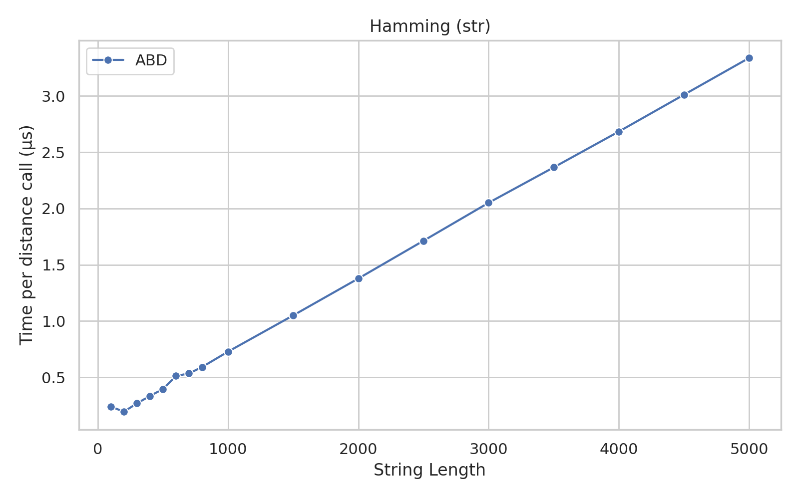
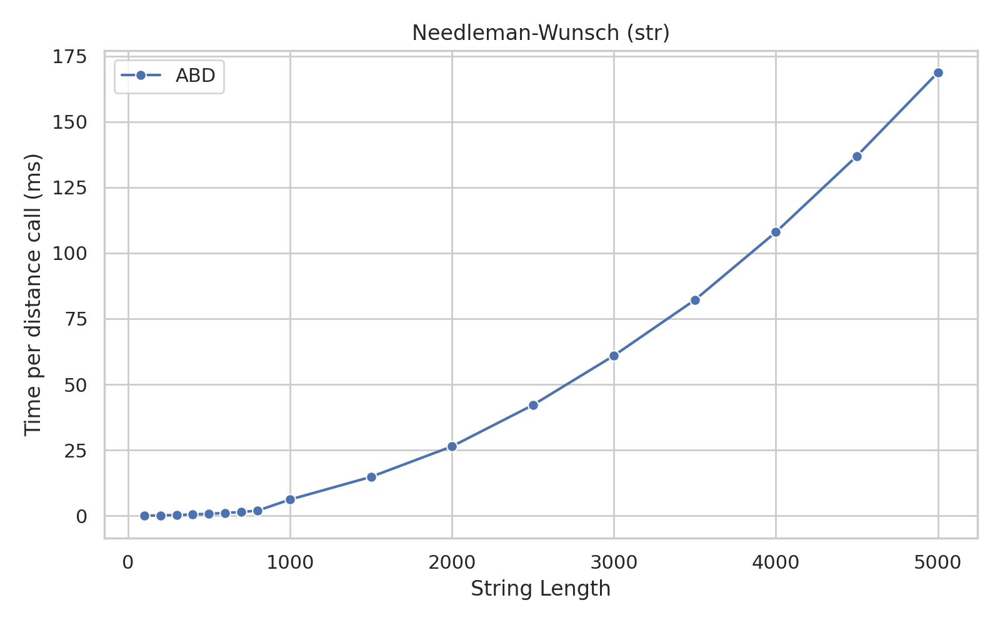

# Algorithms for Big Data: Distances (v0.1.1-dev0)

This package contains algorithms for computing distances between data points.
It is a thin Python wrapper around the `distances` crate, in Rust.

## Installation

```bash
pip install abd_distances@0.1.1-dev0
```

## Usage

```python
import numpy

from abd_distances.simd import euclidean_f32

a = numpy.array([1.0, 2.0, 3.0], dtype=numpy.float32)
b = a + 3.0

distance = euclidean_f32(a, b)

print(distance)
```

## Benchmarks

These benchmarks were run on an Intel Core i7-11700KF CPU @ 4.900GHz, using a single thread.
The OS was Arch Linux, with kernel version 6.7.4-arch1-1.

### SIMD-Accelerated Vector Distances

<table>
<tr>
<th> f32 </th>
<th> f64 </th>
</tr>
<tr>
<td>





</td>
<td>





</td>
</tr>
</table>

### Vector Distance Benchmarks (No SIMD)

<table>
<tr>
<th> F32 </th>
<th> F64 </th>
</tr>
<tr>
<td>


</td>
<td>







</td>
</tr>
</table>

<table>
<tr>
<th> u32 </th>
<th> u64 </th>
</tr>
<tr>
<td>


</td>
<td>


</td>
</tr>
</table>

<table>
<tr>
<th> i32 </th>
<th> i64 </th>
</tr>
<tr>
<td>


</td>
<td>


</td>
</tr>
</table>

### String Distance Benchmarks

These benchmarks were run on an Intel Core i7-11700KF CPU @ 4.900GHz, using a single thread.
The OS was Arch Linux, with kernel version 6.7.4-arch1-1.

All string distances were computed 100 times each, among different pairs of strings, and the average time was taken.






## License

This package is licensed under the MIT license.
